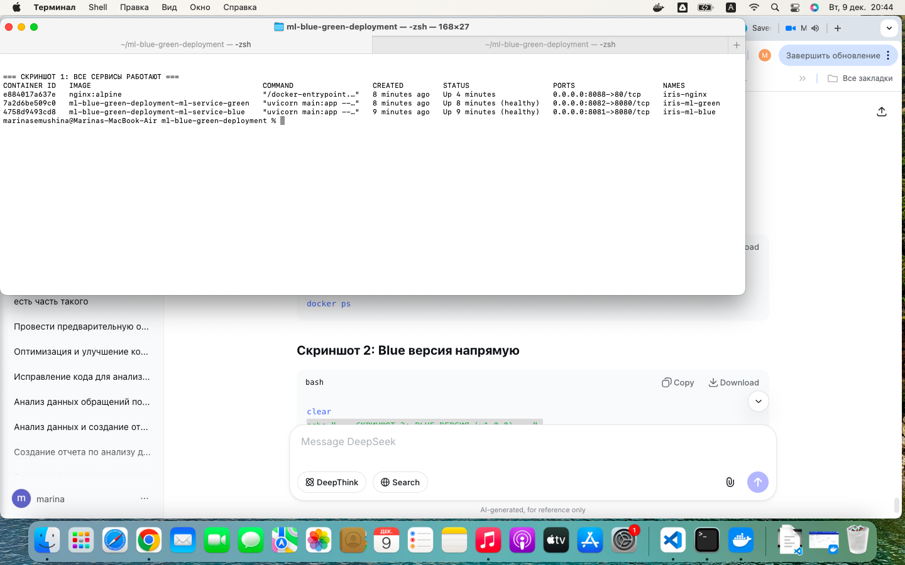
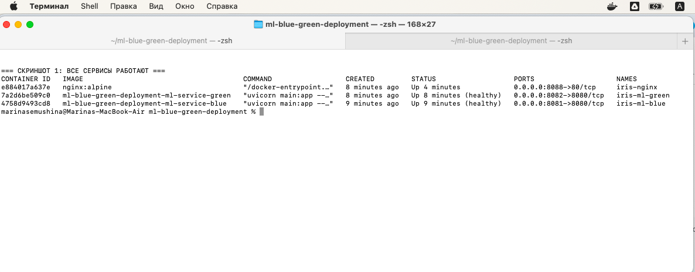
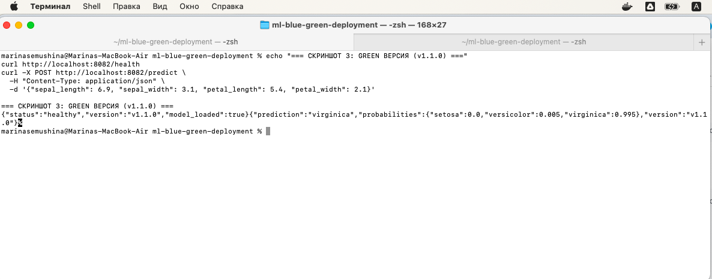
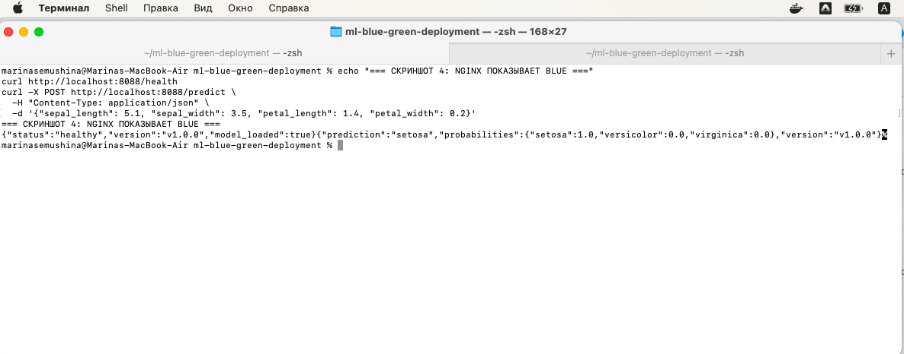
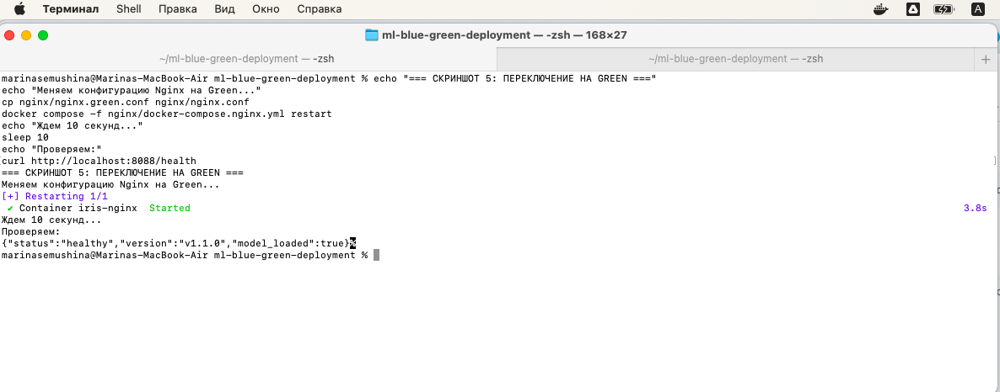

# Скриншоты работы Blue-Green Deployment

## Скриншот 1: Все Docker контейнеры запущены

## Скриншот 2: Проверка Blue версии

## Скриншот 3: Предсказание через Blue версию

## Скриншот 4: Проверка Green версии

## Скриншот 5: Переключение трафика на Green

## Что изображено на скриншотах:

1. **screenshot1.png** - Все три Docker контейнера работают:
   - iris-ml-blue (порт 8081)
   - iris-ml-green (порт 8082)
   - iris-nginx (порт 8088)

2. **screenshot2.png** - Blue версия (v1.0.0) отвечает через /health

3. **screenshot3.png** - Предсказание через Blue версию

4. **screenshot4.png** - Green версия (v1.1.0) отвечает через /health

5. **screenshot5.png** - Переключение трафика на Green версию
